# ml_labb2

### 1

Move the clusters around and change their sizes to make it easier or
harder for the classifier to find a decent boundary. Pay attention
to when the optimizer (minimize function) is not able to find a
solution at all.

Here is the first normal cluster we generated and seperated with linear kernal.
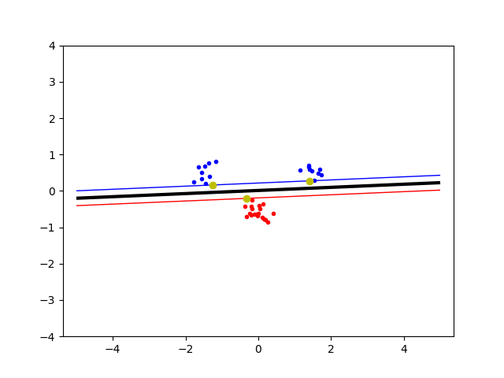

We then moved the generation of the data so that the two classes had the same generative function. Then it couldnt find a solution as seen in figure below.
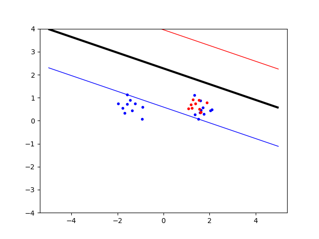

### 2

Implement the two non-linear kernels. You should be able to classify
very hard data sets with these.

This is not really a question, but here is the code for them:
```python
def RBFkernal(x, y):
    # The parameter σ is used to control the smoothness of the boundary.
    sigma = 5
    dist = numpy.linalg.norm(x-y)  # Euclidian distance
    # Radial basis function kernal
    return numpy.power(math.e, (-dist/(2*numpy.power(sigma, 2))))


def PolyKernel(x, y):
    p = 10
    return numpy.power(numpy.dot(x, y) + 1, p)
```

### 3

The non-linear kernels have parameters; explore how they influence
the decision boundary. Reason about this in terms of the bias/variance
trade-off.

#### Poly kernal

Here we increased P whilst evaluating the same classes and data.
When we increase P the variance decreases, but the bias increases. And when P becomes too big it turns very janky.
For the data we tried, a P between 5 and 10 worked best.

p = 2
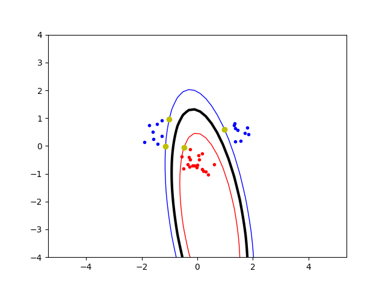

p = 3
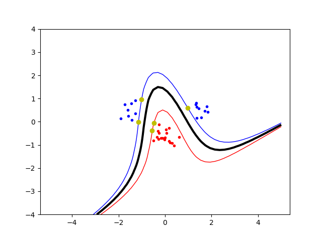

p = 5
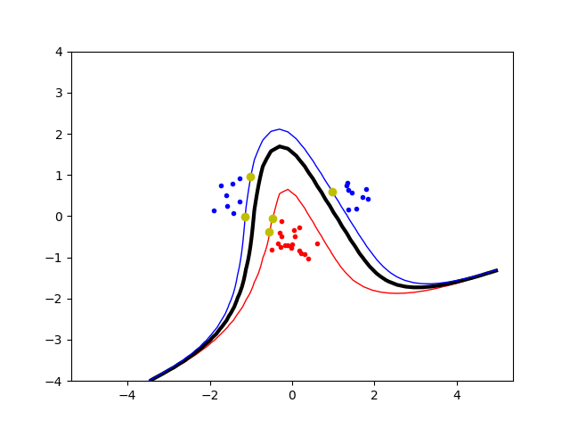

p = 10
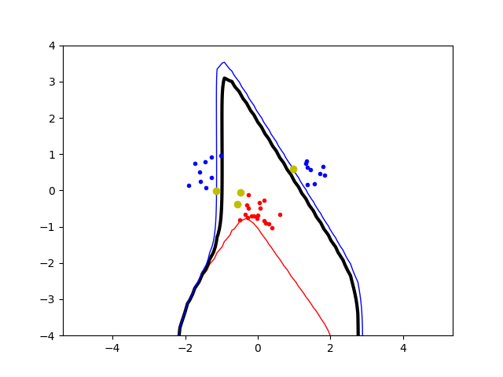


#### RBF kernal

Here we increased σ whilst evaluating the same classes and data.
When we increase σ the variance increases, and the bias decreases.
The number of support vectors also seemed to decrease with higher σ

σ = 0.1
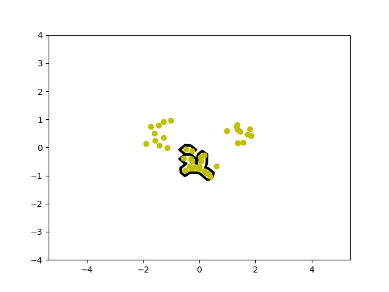

σ = 1
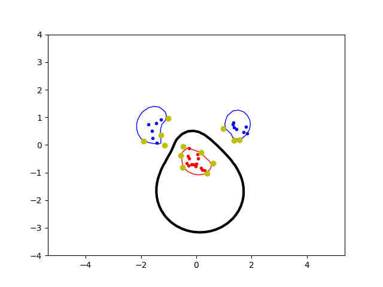

σ = 2
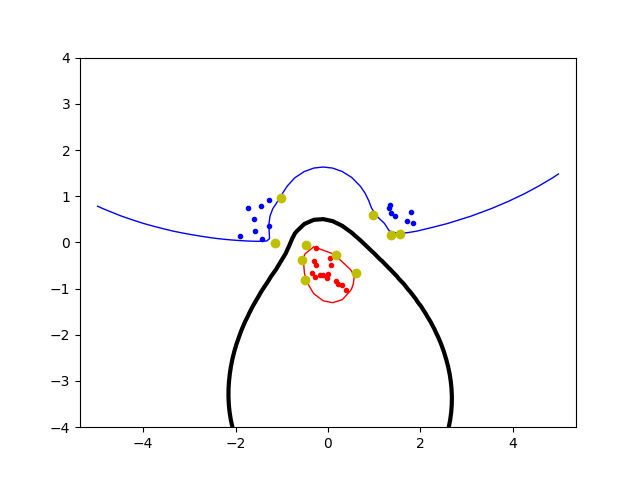

σ = 5
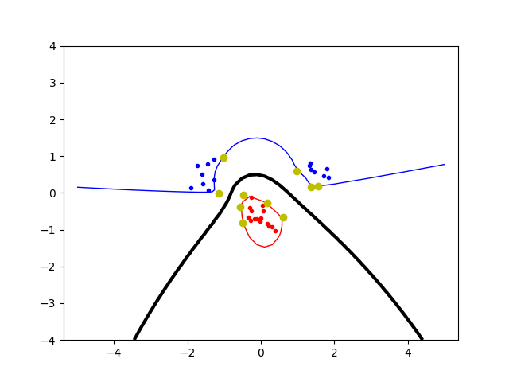

### 4

Explore the role of the slack parameter C. What happens for very
large/small values?

c = 1
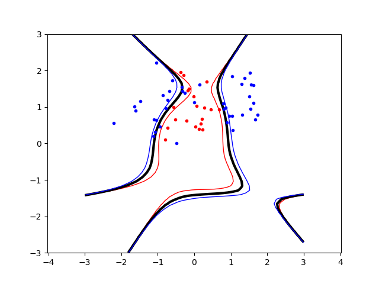

c = 100
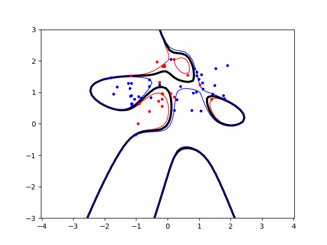

What happens with a low C is that the blue and red line are close to each other as to prevent errors from happening.
With bigger C value there is more space and we allow for more errors.
We weren't able to generate a good set where the classification becomes really bad with a low C, but it is easy to imagine a case where we mess up our entire classification if we don't allow any slack. On the other hand if we allow too much slack we might miss important information.

### 5

Imagine that you are given data that is not easily separable. When should you opt for more slack rather than going for a more complex model (kernel) and vice versa?

If the data is hard to separate its good to allow some slack, and perhaps a simpler kernal so that the amount of support vectors doesn't shoot through the roof. If we use a complex kernal we risk overfitting the complex data, but with a simple kernal we might incorrectly classify some data. So we think it depends on the type of application and what kind of data we are working with, if its to classify dogs/cats then a simple kernal is better, and if we are not allowed to make a misstake, a more complex kernal with less slack is better.
