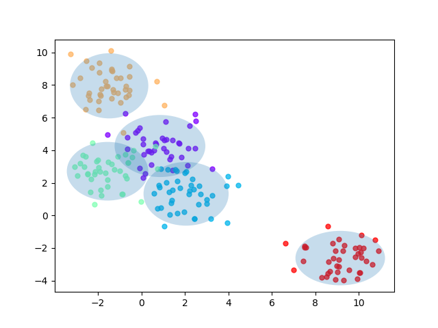
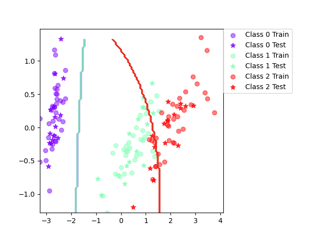
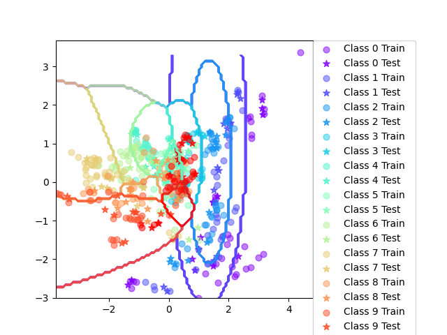
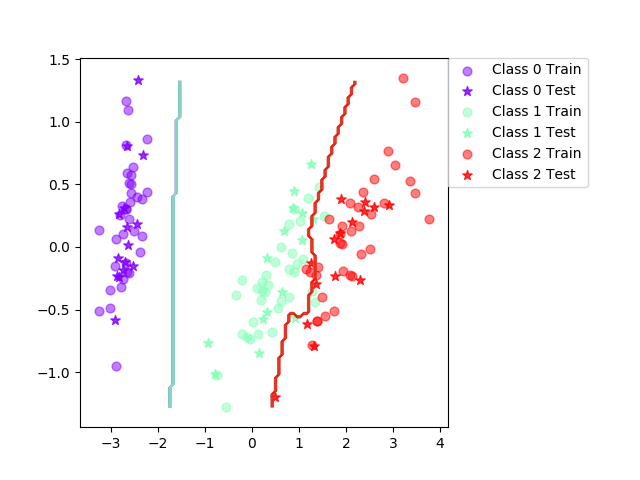
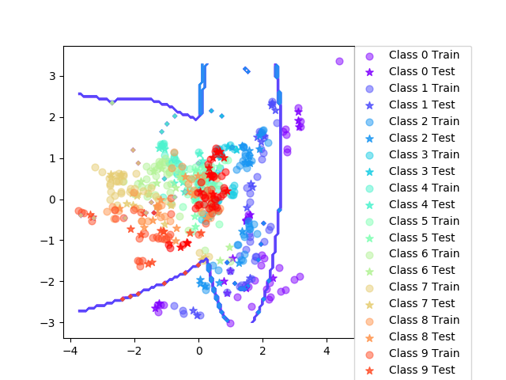
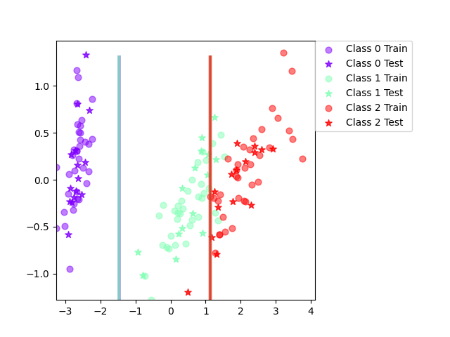
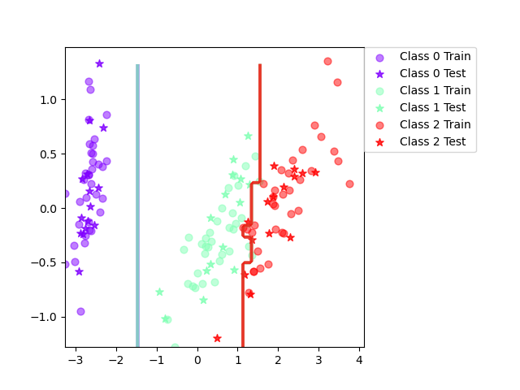

# ml_labb3

## Assignment 1

Here is the plot for the assignment

## Assignment 2

Only code to this assignment

## Assignment 3

### IRIS

| Trial | Accuracy |
| ----- | -------- |
| 0     | 84.4     |
| 10    | 95.6     |
| 20    | 93.3     |
| 30    | 86.7     |
| 40    | 88.9     |
| 50    | 91.1     |
| 60    | 86.7     |
| 70    | 91.1     |
| 80    | 86.7     |
| 90    | 91.1     |

Final mean classification accuracy 89 with standard deviation 4.16

### Vowel

| Trial | Accuracy |
| ----- | -------- |
| 0     | 61.0     |
| 10    | 66.2     |
| 20    | 74.0     |
| 30    | 66.9     |
| 40    | 59.7     |
| 50    | 64.3     |
| 60    | 66.9     |
| 70    | 63.6     |
| 80    | 62.3     |
| 90    | 70.8     |

Final mean classification accuracy 64.7 with standard deviation 4.03

### Questions

(1) When can a feature independence assumption be reasonable and when not?

We can try to understand the underlying concept of the features and then make a qualified guess as to if they are independed or not. Otherwise we can try to make a model where we assume independence and one where we do not and compare them.

In naive bayes the assumption is that the features are independent, and even though the features likeley are dependent the model performs well. In the Iris data set one could guess that petal length and petal width is dependent as well as sepal length and width.

(2) How does the decision boundary look for the Iris dataset? How could one improve
the classifcation results for this scenario by changing classifer or, alternatively,
manipulating the data?

It looks pretty good! Its a pretty easy data set. Class 1 and 2 overlap a bit though which results in a weird turn of the boundry to the left. SVM could probably have worked better.

# Assignment 5

### Iris

Final mean classification accuracy 94.1 with standard deviation 6.72

### Vowel

Final mean classification accuracy 80.2 with standard deviation 3.52

(1) Is there any improvement in classication accuracy? Why/why not?

Yes, there is better classification on both Iris and Vowel dataset. Because the boosting allows us to focus on the missqualified data.

(2) Plot the decision boundary of the boosted classier on iris and compare it with
that of the basic. What dierences do you notice? Is the boundary of the boosted
version more complex?

The boundy fits the data better and has a bit more complex shape, its no longer leaning left.

(3) Can we make up for not using a more advanced model in the basic classier
(e.g. independent features) by using boosting?

Yeah its of course possible to increase accuracy of a weak classifier by using a booster. We guess its possible to make up, but it depends on case to case wether a weak classifier even with boosting works better.

# Assignment 6

## Iris tree

| Trial | Accuracy |
| ----- | -------- |
| 0     | 95.6     |
| 10    | 100.0    |
| 20    | 91.1     |
| 30    | 91.1     |
| 40    | 93.3     |
| 50    | 91.1     |
| 60    | 88.9     |
| 70    | 88.9     |
| 80    | 93.3     |
| 90    | 88.9     |

Final mean classification accuracy 92.4 with standard deviation 3.71

## Iris tree boosted

| Trial | Accuracy |
| ----- | -------- |
| 0     | 95.6     |
| 10    | 100.0    |
| 20    | 95.6     |
| 30    | 93.3     |
| 40    | 93.3     |
| 50    | 95.6     |
| 60    | 88.9     |
| 70    | 93.3     |
| 80    | 93.3     |
| 90    | 93.3     |

Final mean classification accuracy 94.6 with standard deviation 3.65

## Vowel tree

| Trial | Accuracy |
| ----- | -------- |
| 0     | 63.6     |
| 10    | 68.8     |
| 20    | 63.6     |
| 30    | 66.9     |
| 40    | 59.7     |
| 50    | 63.0     |
| 60    | 59.7     |
| 70    | 68.8     |
| 80    | 59.7     |
| 90    | 68.2     |

Final mean classification accuracy 64.1 with standard deviation 4

## Vowel tree boosted

| Trial | Accuracy |
| ----- | -------- |
| 0     | 85.1     |
| 10    | 85.7     |
| 20    | 88.3     |
| 30    | 91.6     |
| 40    | 83.8     |
| 50    | 79.2     |
| 60    | 88.3     |
| 70    | 86.4     |
| 80    | 88.3     |
| 90    | 89.0     |

Final mean classification accuracy 86.6 with standard deviation 3.02

## Questions

(1) Is there any improvement in classication accuracy? Why/why not?

Yeah, the boosted is better than the normal tree. The decision tree is a pretty weak classifier and we thus get a good increase in accuracy.

(2) Plot the decision boundary of the boosted classier on iris and compare it with
that of the basic. What dierences do you notice? Is the boundary of the boosted
version more complex?

A little more complex, but a little more edgy as well.

(3) Can we make up for not using a more advanced model in the basic classier
(e.g. independent features) by using boosting?

Yeah its of course possible to increase accuracy of a weak classifier by using a booster. We guess its possible to make up, but it depends on case to case wether a weak classifier even with boosting works better.

# Assignment 7
Outliers:
Naive Bayes. Since DT will overfit the data and be misguided by the outliers and the boosting model will also focus more on the outliers.

Irrelevant input:
DT is better as it does not form itself to irrelevant parts of the feature space.

scalabiliy:
DT if dimension of data is large. Matrices are difficult to calculate as they grow in size, same with huge trees

Predictive power:
NB, boosting as it was better

Mixed types of data (ex. binary, categorial or continuous features):
NB does better on continuous data input than decision trees
